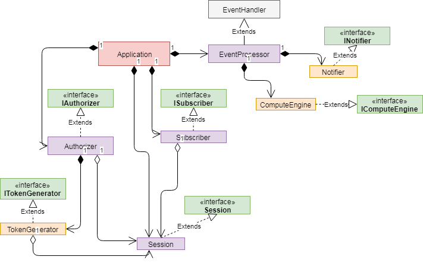

# MktNotifierApp

This example includes an application and the unit tests for the application.

The `MktNotifierApp` is an example for how a BLPAPI application can be
structured and unit tested.

## Description of the example

This example will test the application by mocking the essential objects.

The interfaces in the diagram give us the ability to create mock objects by
mocking these interfaces.

The `Authorizer` is responsible for setting up the authentication of the
application, including creating and sending the auth request and awaiting a
successful reply.

The `Subscriber` is responsible for setting up the subscription for certain topics.

The `EventProcessor` handles all the incoming events and triggers business logic
(`ComputeEngine` or `Notifier`).

The `Notifier` fires notifications within the system such as sending alerts to
the terminal.

The `ComputeEngine` does complex computations on incoming data and passes it off
to the `Notifier`.

The actual application does the following:

 * Sets up the necessary objects (`Notifier`, `ComputeEngine`, `Session`,
   `TokenGenerator`, `Authorizer`, `Subscriber`)
 * Starts the session
 * Authorizes the application
 * Subscribes to topics
 * Allows the `EventProcessor` to process the incoming events
 * Calling methods from `Notifier` and/or `ComputeEngine`
